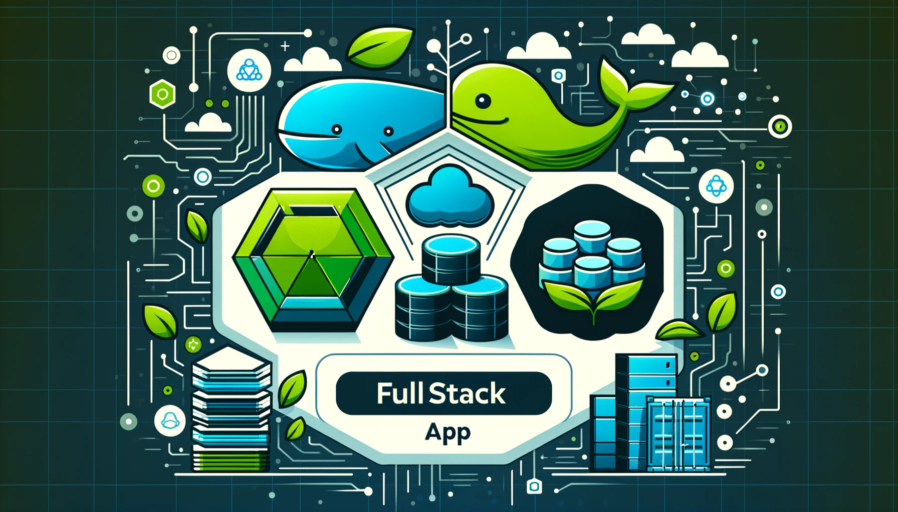

This project is a comprehensive example of a fullstack application, showcasing the integration of Node.js, MongoDB, and Docker. The application demonstrates how to build a robust, scalable backend using Node.js, manage data with MongoDB, and containerize the application using Docker for consistent and efficient deployment.

**Key Features:**

- Node.js Backend: A powerful and flexible backend built with Node.js, providing RESTful APIs for seamless data interaction.
  
- React Frontend: A dynamic and responsive frontend built with React.
  - Goal Management: Components for adding, displaying, and deleting goals.
  - Error Handling: Components for displaying error messages when interactions with the backend fail.
  - State Management: Uses React hooks to manage state and side effects.

- MongoDB Database: A highly scalable and flexible NoSQL database used to store and manage application data.

Docker Integration: The entire application is containerized using Docker, ensuring consistency across different environments and simplifying the deployment process.
